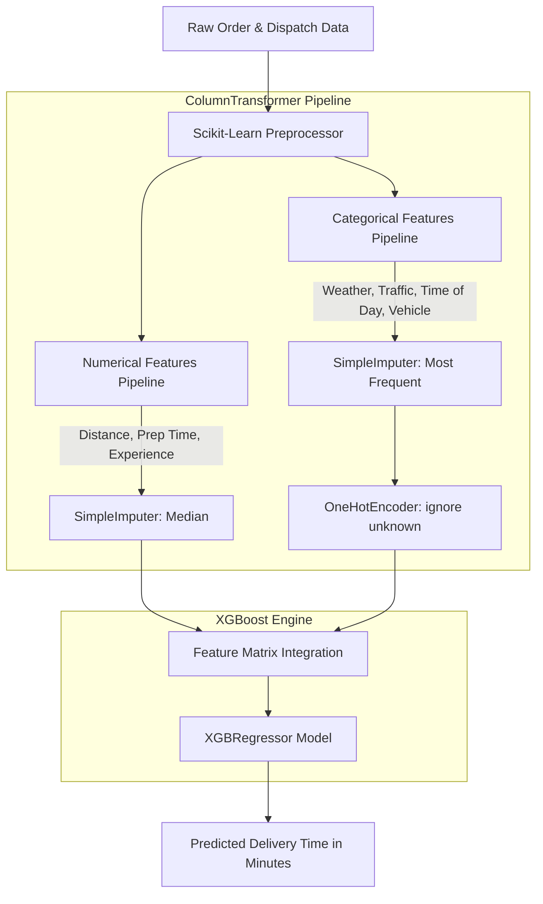

# Estimated Time of Arrival (ETA) Prediction System

[](https://www.python.org/)
[](https://xgboost.readthedocs.io/)
[](https://scikit-learn.org/)
[](https://pandas.pydata.org/)
[](LICENSE)
[](https://github.com/Monishwaran45/Estimated-Time-of-Arrival-Prediction-System)

A high-performance Machine Learning solution designed to predict food delivery **Estimated Time of Arrival (ETA)** in real-time. By leveraging **XGBoost Regressor** combined with a robust **Scikit-Learn ColumnTransformer Pipeline**, this system accurately models the complex non-linear relationships between delivery distance, preparation time, traffic conditions, weather factors, vehicle types, and courier experience.

---

## Table of Contents
- [Key Features](#-key-features)
- [System Architecture](#-system-architecture)
- [Dataset & Feature Dictionary](#-dataset--feature-dictionary)
- [Exploratory Data Analysis (EDA)](#-exploratory-data-analysis-eda)
- [Model Pipeline & Engineering](#-model-pipeline--engineering)
- [Performance & Evaluation](#-performance--evaluation)
- [Project Directory Structure](#-project-directory-structure)
- [Installation & Quickstart](#-installation--quickstart)
- [Model Inference (Usage Example)](#-model-inference-usage-example)
- [Model Artifacts](#-model-artifacts)
- [Author & Acknowledgments](#-author--acknowledgments)

---

## Key Features

- **End-to-End Pipeline**: Encapsulates automated missing value imputation, categorical one-hot encoding, and regression modeling within a single Scikit-Learn `Pipeline`.
- **High Predictive Power**: Utilizes gradient boosted decision trees (`XGBRegressor`) tuned with `n_estimators=300`, `learning_rate=0.05`, and `max_depth=6`.
- **Fault-Tolerant Preprocessing**: Employs `handle_unknown="ignore"` for categorical features and median/mode imputation to seamlessly handle real-world dirty or missing data.
- **Production Serialization**: Multi-format serialized models available in `.joblib`, `.pkl`, and native XGBoost `.json` formats for versatile deployment across microservices and edge APIs.
- **Explainable AI (XAI)**: Includes feature importance analysis identifying critical operational bottlenecks impacting delivery duration.

---

##  System Architecture



---

##  Dataset & Feature Dictionary

The model is trained on `Food_Delivery_Times.csv`, which tracks delivery orders across varied environmental and operational constraints:

| Column Name | Type | Description | Sample Values / Categories |
| :--- | :--- | :--- | :--- |
| `Distance_km` | `float` | Delivery route distance in kilometers | `7.93`, `16.42`, `9.52` |
| `Weather` | `string` | Weather conditions during delivery | `Clear`, `Rainy`, `Snowy`, `Foggy`, `Windy` |
| `Traffic_Level` | `string` | Road traffic congestion level | `Low`, `Medium`, `High` |
| `Time_of_Day` | `string` | Time period when order was placed | `Morning`, `Afternoon`, `Evening`, `Night` |
| `Vehicle_Type` | `string` | Vehicle utilized by the delivery courier | `Bike`, `Scooter`, `Car` |
| `Preparation_Time_min` | `int` | Time taken by the restaurant to prepare the food | `5`, `12`, `20`, `28` (min) |
| `Courier_Experience_yrs`| `float` | Experience of the delivery partner in years | `1.0`, `2.0`, `5.0`, `9.0` |
| **`Delivery_Time_min`** | `int` | **Target Variable**: Total delivery duration in minutes | `37`, `43`, `59`, `84` (min) |

---

## Exploratory Data Analysis (EDA)

Key insights uncovered during exploratory data analysis:
1. **Distance Impact**: Direct linear and non-linear correlation with delivery duration; trips exceeding 15 km show compounding delays under adverse conditions.
2. **Weather & Traffic Amplification**: Rainy and Snowy conditions combined with High traffic significantly shift the distribution tail toward longer delivery windows (>70 min).
3. **Courier Experience Curve**: Seasoned couriers (5+ years) consistently optimize route choices, demonstrating lower variance in transit time.

---

##  Model Pipeline & Engineering

### 1. Data Transformation
- **Numerical Features** (`Distance_km`, `Preparation_Time_min`, `Courier_Experience_yrs`):
  - Missing value replacement using `SimpleImputer(strategy="median")`.
- **Categorical Features** (`Weather`, `Traffic_Level`, `Time_of_Day`, `Vehicle_Type`):
  - Missing value replacement using `SimpleImputer(strategy="most_frequent")`.
  - Encoding with `OneHotEncoder(handle_unknown="ignore")`.

### 2. Model Configuration
```python
from xgboost import XGBRegressor

model = XGBRegressor(
    n_estimators=300,
    learning_rate=0.05,
    max_depth=6,
    random_state=42
)
```

---

## 📈 Performance & Evaluation

The model was evaluated on an unseen 20% test split:

| Evaluation Metric | Test Score | Description |
| :--- | :--- | :--- |
| **MAE (Mean Absolute Error)** | **~7.28 min** | Average prediction deviation from ground truth delivery time |
| **RMSE (Root Mean Squared Error)** | **~9.98 min** | Penalizes larger estimation errors |
| **$R^2$ Score (Coefficient of Determination)** | **0.778 (77.8%)** | Proportion of delivery duration variance explained by the model |

---

##  Project Directory Structure

```text
Estimated-Time-of-Arrival-Prediction-System/
├── Food_Delivery_Times.csv     # Training & evaluation dataset
├── Untitled-1.ipynb            # Complete Jupyter Notebook (EDA, Pipeline, Training, Evaluation)
├── ETA.joblib                  # Serialized Scikit-Learn + XGBoost full pipeline (Joblib)
├── ETA.pkl                     # Serialized Scikit-Learn + XGBoost full pipeline (Pickle)
├── xgb_model.json              # Exported native XGBoost booster configuration
├── requirements.txt            # Project dependencies
└── README.md                   # Project documentation
```

---

##  Installation & Quickstart

### Prerequisites
- Python 3.9 or higher
- Git

### 1. Clone the Repository
```bash
git clone https://github.com/Monishwaran45/Estimated-Time-of-Arrival-Prediction-System.git
cd Estimated-Time-of-Arrival-Prediction-System
```

### 2. Create and Activate a Virtual Environment
```bash
# Windows
python -m venv .venv
.venv\Scripts\activate

# macOS / Linux
python3 -m venv .venv
source .venv/bin/activate
```

### 3. Install Dependencies
```bash
pip install -r requirements.txt
```

---

##  Model Inference (Usage Example)

You can generate instant ETA predictions on new orders using the pre-trained pipeline:

```python
import joblib
import pandas as pd

# 1. Load the pre-trained end-to-end pipeline
pipeline = joblib.load("ETA.joblib")

# 2. Define incoming order attributes
new_order = pd.DataFrame({
    "Distance_km": [12.5],
    "Weather": ["Rainy"],
    "Traffic_Level": ["High"],
    "Time_of_Day": ["Evening"],
    "Vehicle_Type": ["Bike"],
    "Preparation_Time_min": [18],
    "Courier_Experience_yrs": [5.0]
})

# 3. Predict Estimated Delivery Time
predicted_eta = pipeline.predict(new_order)
print(f"⏱️ Estimated Delivery Time: {predicted_eta[0]:.2f} minutes")
```

**Output:**
```text
⏱️ Estimated Delivery Time: 73.16 minutes
```

---

##  Model Artifacts

| File Name | Format | Use Case |
| :--- | :--- | :--- |
| `ETA.joblib` | Joblib Binary | Recommended for Python backend APIs (FastAPI, Flask, Django). |
| `ETA.pkl` | Standard Pickle | Standard Python serialization format. |
| `xgb_model.json` | XGBoost JSON | Cross-platform deployment (C++, Go, Java, Triton Inference Server). |

---

## 👨‍💻 Author & Acknowledgments

- **Author**: [Monishwaran45](https://github.com/Monishwaran45)
- **Repository**: [Estimated-Time-of-Arrival-Prediction-System](https://github.com/Monishwaran45/Estimated-Time-of-Arrival-Prediction-System)

If you find this project helpful, please consider giving it a ⭐ on GitHub!
