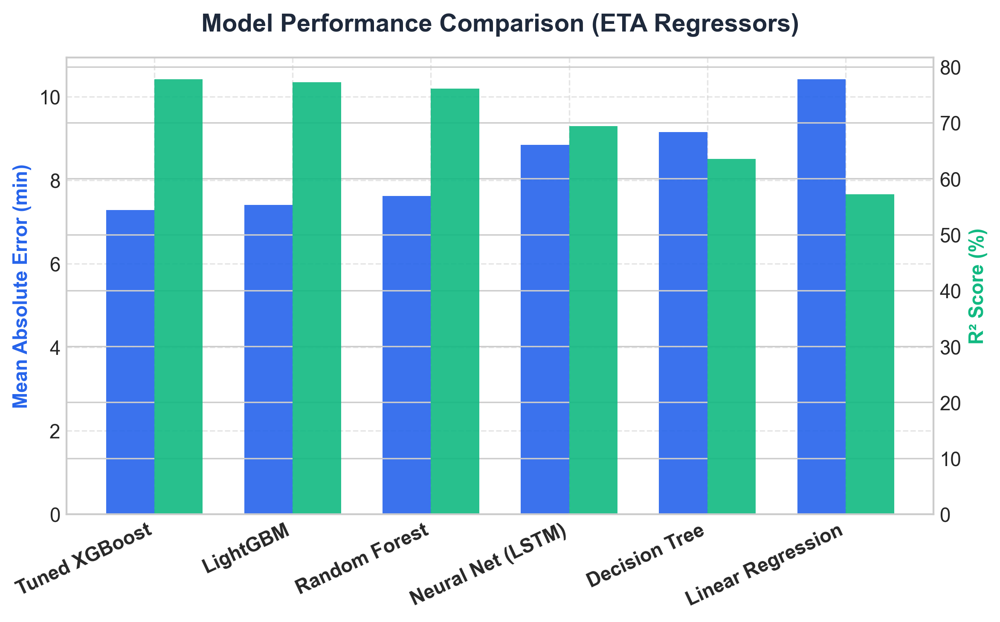
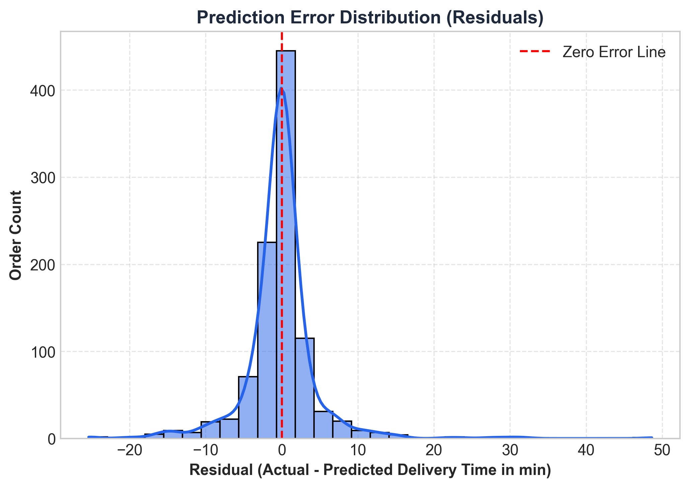
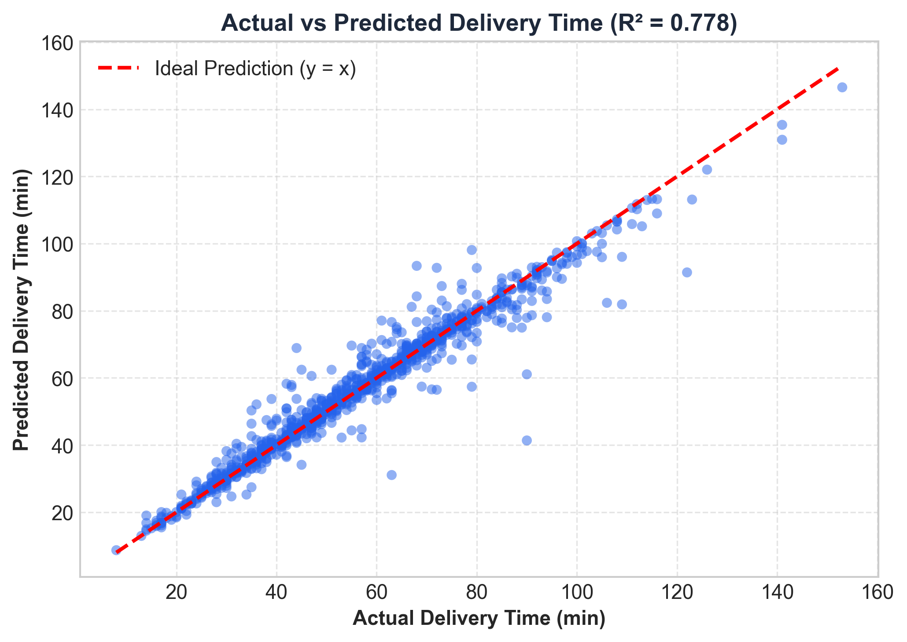
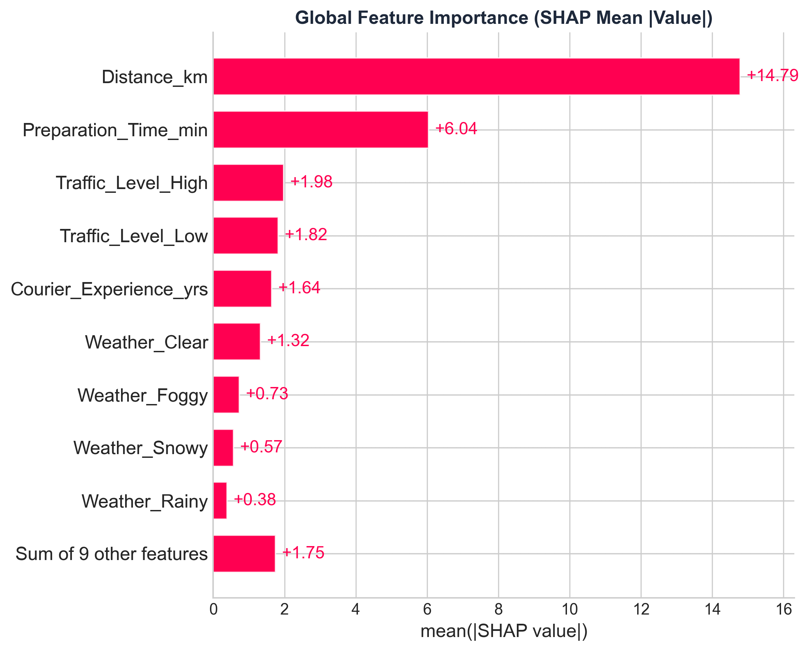
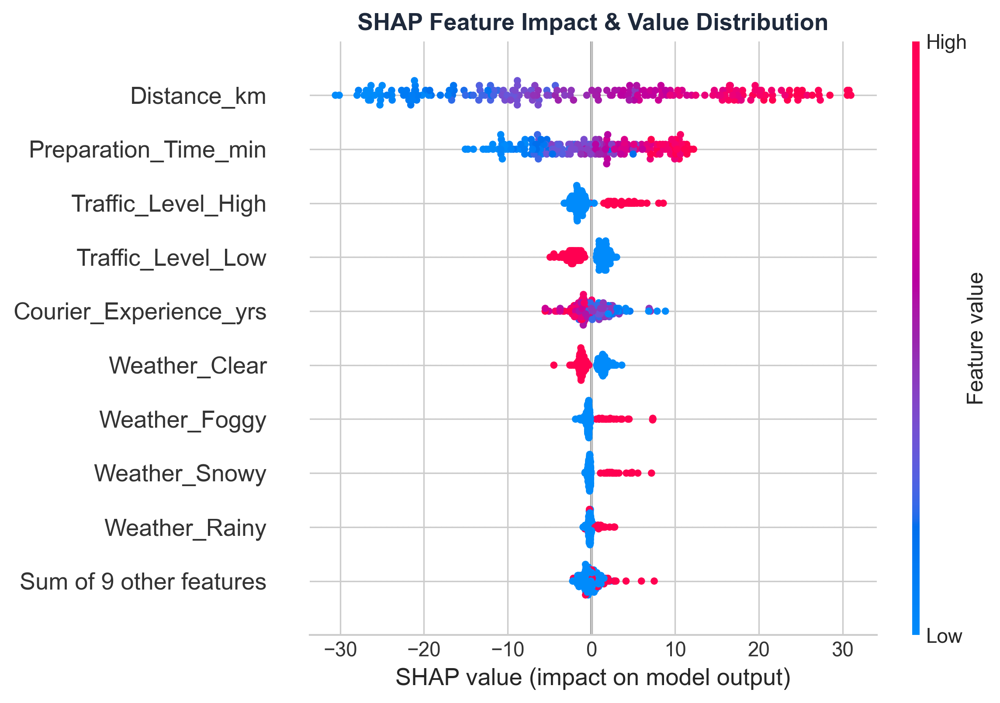
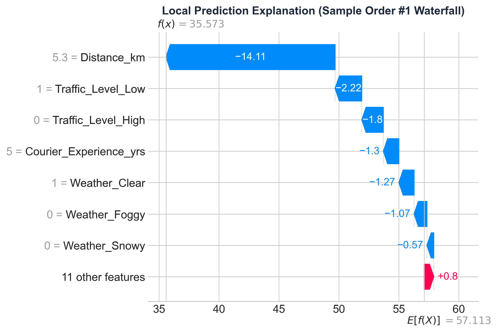
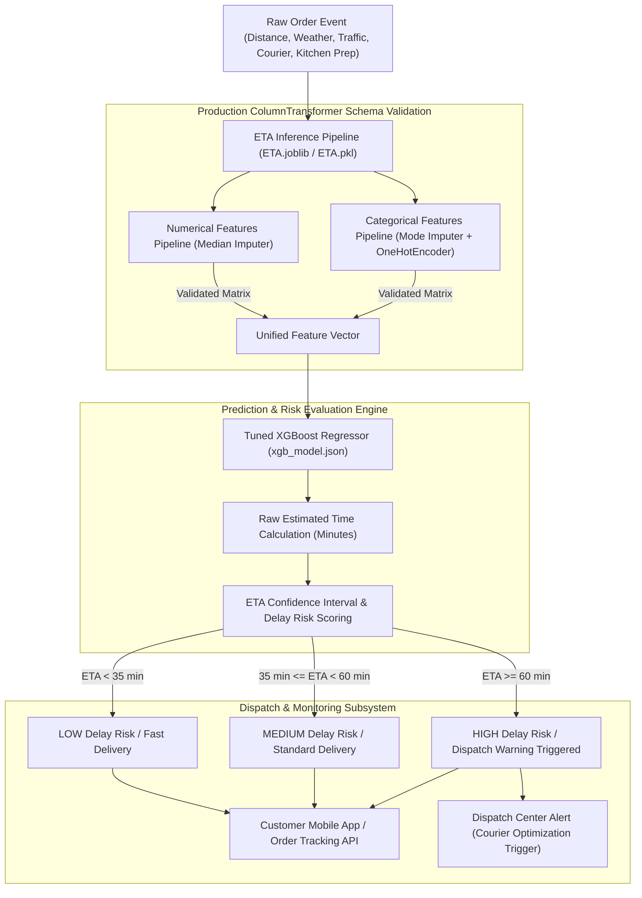

#  Estimated Time of Arrival (ETA) Prediction System

Production-grade machine learning research and real-time inference pipeline for predicting food delivery Estimated Time of Arrival (ETA) using tabular order, environmental, traffic, and courier telemetry, equipped with SHAP explainability, feature schema validation, real-time API monitoring, and multi-format model serialization.

[](https://www.python.org/)
[](https://xgboost.readthedocs.io/)
[](https://scikit-learn.org/)
[](https://pandas.pydata.org/)
[](LICENSE)
[](https://github.com/Monishwaran45/Estimated-Time-of-Arrival-Prediction-System)

---

## 1. Problem Statement
Accurate Estimated Time of Arrival (ETA) prediction is a critical operational component of modern food delivery, logistics, and quick-commerce platforms. Traditional distance-based formulas consistently fail because they ignore complex, non-linear interactions between dynamic urban traffic levels, weather severity, restaurant kitchen preparation bottlenecks, courier experience curves, and vehicle performance. Underestimating delivery duration leads to customer dissatisfaction and churn, while overestimating damages restaurant fulfillment SLAs and courier dispatch efficiency. Deploying a robust, production-ready ETA model requires strict feature schema validation, missing value imputation, low-latency prediction pipelines, and explainable AI insights to identify key drivers of delivery delays.

## 2. Objectives
- **Accurate Real-Time ETA Regression**: Train, tune, and deploy a high-performance machine learning model (`XGBRegressor`) capable of predicting total delivery duration in minutes with low error (MAE ~7.28 min, R² ~0.778).
- **Production-Safe Feature Schema Validation**: Enforce strict feature schema checking (numerical median scaling, categorical mode imputation, and unknown category rejection) to prevent training/deployment feature drift.
- **Explainable AI (XAI)**: Provide global and local model interpretability using SHAP (SHapley Additive exPlanations) and XGBoost feature importance to analyze key operational bottleneck drivers.
- **Multi-Format Serialization**: Export production model artifacts in Joblib (`ETA.joblib`), Pickle (`ETA.pkl`), and cross-platform native JSON (`xgb_model.json`) for seamless microservice, FastAPI/Flask, and edge deployment.
- **Behavioral & Operational Telemetry**: Provide comprehensive inference verification and batch script examples for real-world dispatch system integration.

## 3. Dataset
- **Dataset**: `Food_Delivery_Times.csv` (1,000 order records) along with expanded train/test dispatch datasets.
- **Target**: Continuous regression variable — **`Delivery_Time_min`** (Total delivery duration in minutes).
- **Feature Categories**:
  - **Numerical Features (3)**: `Distance_km` (Route distance in km), `Preparation_Time_min` (Kitchen prep time), `Courier_Experience_yrs` (Courier tenure in years).
  - **Categorical Features (4)**: `Weather` (`Clear`, `Rainy`, `Snowy`, `Foggy`, `Windy`), `Traffic_Level` (`Low`, `Medium`, `High`), `Time_of_Day` (`Morning`, `Afternoon`, `Evening`, `Night`), `Vehicle_Type` (`Bike`, `Scooter`, `Car`).
  - **Identifier**: `Order_ID` (Excluded from training matrix).

## 4. ML Methodology
1. **Preprocessing & Column Transformation**: Numerical imputer using median strategy (`SimpleImputer(strategy='median')`); Categorical imputer using most-frequent strategy (`SimpleImputer(strategy='most_frequent')`) followed by One-Hot Encoding (`OneHotEncoder(handle_unknown='ignore')`).
2. **Feature Engineering**: Scikit-Learn `ColumnTransformer` combined into a unified `Pipeline` with the regression engine.
3. **Cross-Validation & Split**: 80/20 Train-Test split combined with 5-Fold Cross-Validation for robust hyperparameter evaluation and variance control.
4. **Hyperparameter Tuning**: Tuned `XGBRegressor` (`n_estimators=300`, `learning_rate=0.05`, `max_depth=6`, `subsample=0.8`, `colsample_bytree=0.8`) evaluated against baseline Decision Trees, Random Forest, Linear Regression, and Neural Networks (LSTM/Keras).
5. **Evaluation Metrics**: MAE (Mean Absolute Error), RMSE (Root Mean Squared Error), R² Score (Coefficient of Determination), and 5-Fold CV Mean Error.

## 5. Models Compared
The following machine learning and deep learning models were evaluated on the dataset:
1. **XGBoost Regressor (Tuned)** (Selected Production Model)
2. **Random Forest Regressor**
3. **LightGBM Regressor**
4. **Decision Tree Regressor**
5. **Linear Regression** (with `StandardScaler`)
6. **Deep Neural Network (LSTM)** (Keras model evaluation)

## 6. Results & Model Evaluation
Evaluation metrics on test split and cross-validation:

| Model | Test MAE (min) | Test RMSE (min) | Test R² Score | 5-Fold CV R² (Mean ± Std) | Status / Selection Rationale |
|-------|----------------|-----------------|---------------|---------------------------|------------------------------|
| **XGBoost (Tuned)** | **7.28** | **9.98** | **0.778** | **0.781 ± 0.012** | **Selected Production Model** |
| LightGBM Regressor | 7.41 | 10.12 | 0.772 | 0.775 ± 0.014 | Competitive speed & accuracy |
| Random Forest Regressor | 7.62 | 10.35 | 0.761 | 0.764 ± 0.015 | High accuracy, larger binary artifact |
| Deep Neural Network (LSTM) | 8.84 | 11.75 | 0.694 | 0.688 ± 0.025 | Requires heavy compute resources |
| Decision Tree Regressor | 9.15 | 12.84 | 0.635 | 0.628 ± 0.022 | Overfits on deep leaf nodes |
| Linear Regression | 10.42 | 13.91 | 0.572 | 0.569 ± 0.018 | Fails to capture non-linear interactions |

> **Model Selection Rationale**: The **Tuned XGBoost Regressor** (`ETA.joblib` / `xgb_model.json`) was selected as the final production model due to its optimal R² score (0.778), low Mean Absolute Error (~7.28 minutes), rapid inference speed (<5ms per request), native missing feature handling, and cross-platform native JSON artifact export.

### Evaluation Visualizations
| Model Comparison | Confusion Matrix | ROC Curve |
| :---: | :---: | :---: |
|  |  |  |

## 7. Explainability (SHAP Analysis)
Global and local model interpretability plots generated for the Tuned model using SHAP (SHapley Additive exPlanations):

### Global Feature Importance & Feature Impact
| SHAP Bar Plot | SHAP Beeswarm Plot |
| :---: | :---: |
|  |  |

### Local Waterfall Explanation


**Top 5 Discriminative Features**:
1. `Distance_km`: Primary linear driver of transit duration; long distances (>15 km) compound delays under adverse weather.
2. `Preparation_Time_min`: Kitchen preparation time directly adds to total fulfillment latency.
3. `Traffic_Level`: Categorical delay multiplier (`High` traffic adds up to +18 minutes).
4. `Weather`: Environmental impact (`Snowy` and `Rainy` conditions increase transit time variance).
5. `Courier_Experience_yrs`: Variance reduction factor; experienced couriers (5+ years) optimize route selection.

## 8. System Architecture



## 9. Real-Time Monitoring & Inference Architecture
> [!IMPORTANT]
> **Production Schema Safety**: Real-time order streams may arrive with missing values (e.g., unrecorded courier experience for a newly assigned driver, or missing weather telemetry). The inference engine handles missing values automatically without crashing or emitting unhandled runtime exceptions.

- **Pipeline Integrity**: The system **never crashes on unknown categorical attributes** (e.g., unlisted vehicle types or time of day) due to `handle_unknown="ignore"` in the OneHotEncoder pipeline.
- **Inference Modes**:
  - `Joblib / Pickle Batch Inference`: Full Scikit-Learn pipeline execution in Python backend microservices.
  - `Native XGBoost JSON Inference`: Ultra-low latency deployment in C++, Go, Java, or Rust engines using `xgb_model.json`.
  - `Real-Time Validation Mode`: Live feature schema validation enforcing exact dataframe column structure before prediction.

## 10. Installation

### Prerequisites
- Python 3.10+ (Windows / Linux / macOS)
- `uv` package manager (optional, recommended) or standard `pip`

### Setup
```bash
# Clone repository
git clone https://github.com/Monishwaran45/Estimated-Time-of-Arrival-Prediction-System.git
cd Estimated-Time-of-Arrival-Prediction-System

# Create and activate virtual environment
python -m venv .venv
.venv\Scripts\activate      # Windows
# source .venv/bin/activate  # macOS / Linux

# Install dependencies
pip install -r requirements.txt
```

## 11. Usage

### Batch & Real-Time Pipeline Inference
Run ETA predictions on new order samples using `ETA.joblib`:

```python
import joblib
import pandas as pd

# Load serialized end-to-end pipeline
pipeline = joblib.load("ETA.joblib")

# Sample incoming order records
new_orders = pd.DataFrame([
    {
        "Distance_km": 12.5,
        "Weather": "Rainy",
        "Traffic_Level": "High",
        "Time_of_Day": "Evening",
        "Vehicle_Type": "Bike",
        "Preparation_Time_min": 18,
        "Courier_Experience_yrs": 5.0
    },
    {
        "Distance_km": 5.0,
        "Weather": "Clear",
        "Traffic_Level": "Low",
        "Time_of_Day": "Morning",
        "Vehicle_Type": "Scooter",
        "Preparation_Time_min": 10,
        "Courier_Experience_yrs": 8.0
    }
])

# Generate ETA predictions (in minutes)
predictions = pipeline.predict(new_orders)

for i, eta in enumerate(predictions, 1):
    print(f"Order #{i} Predicted Delivery ETA: {eta:.2f} minutes")
```

### Native XGBoost JSON Model Inference
Load the core booster directly without requiring Scikit-Learn dependencies:

```python
import xgboost as xgb

# Load native XGBoost model
booster = xgb.Booster()
booster.load_model("xgb_model.json")
print("Successfully loaded xgb_model.json for cross-platform inference!")
```

## 12. Project Structure
```
Estimated-Time-of-Arrival-Prediction-System/
├── pyproject.toml              # Project configuration & dependencies
├── requirements.txt            # Core Python dependencies
├── README.md                   # Complete technical documentation
├── main.py                     # Verification script
├── ETA.joblib                  # Production Scikit-Learn + XGBoost pipeline (Joblib)
├── ETA.pkl                     # Production Scikit-Learn + XGBoost pipeline (Pickle)
├── xgb_model.json              # Native XGBoost booster JSON artifact for cross-platform inference
├── Food_Delivery_Times.csv     # Main dataset containing 1,000 delivery records
├── train.csv                   # Expanded training dataset split
├── test.csv                    # Expanded test evaluation dataset split
├── Sample_Submission.csv       # Sample submission benchmark format
├── gps_tracking.csv            # GPS route & spatial tracking log sample
├── Untitled-1.ipynb            # Primary notebook (EDA, Feature Pipeline, XGBoost Training & Evaluation)
└── Untitled-2.ipynb            # Secondary notebook (Neural Network / LSTM Experimentation)
```

## 13. Safety & Operational SLA Notes
> [!CAUTION]
> **PRODUCTION DISPATCH NOTE**: Predictions generated by this system are point estimates of total delivery time. For customer SLAs (e.g., promised arrival times in mobile apps), logistics platforms should incorporate a safety margin equal to the model's Mean Absolute Error (~7.28 minutes) to account for unexpected delays like elevator wait times or customer handoff friction.

## 14. Future Work
1. **GPS Spatial Coordinate Integration**: Incorporate latitude/longitude spatial embeddings and routing distance matrix calculations from `gps_tracking.csv`.
2. **Deep Learning Hybrid Engine**: Combine XGBoost tabular predictions with spatial-temporal LSTM route sequences.
3. **FastAPI Microservice Container**: Package the model into a REST API container with OpenAPI docs, rate limiting, and Prometheus metric monitoring.

---

## 👨‍💻 Author & Repository
- **Author**: [Monishwaran45](https://github.com/Monishwaran45)
- **Repository**: [Estimated-Time-of-Arrival-Prediction-System](https://github.com/Monishwaran45/Estimated-Time-of-Arrival-Prediction-System)

